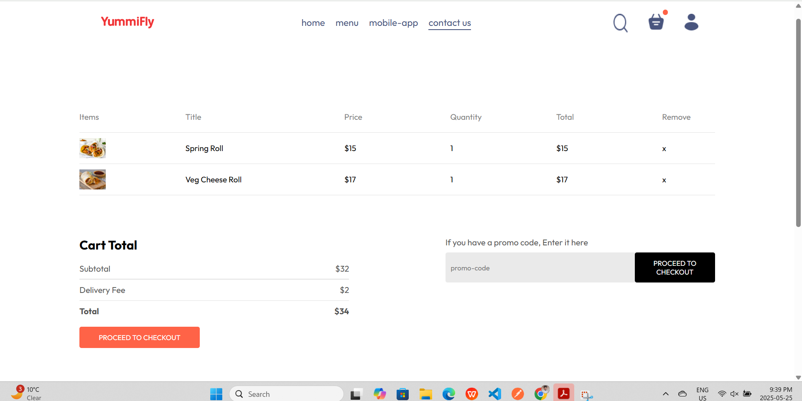

# 🍽️ YummiFly

YummiFly is a full-featured, full-stack **food delivery web application** that allows users to browse restaurants, order their favorite dishes, and track orders in real time. It includes a **user-facing frontend**, a **secure backend API**, and an **admin panel** for restaurant owners or platform managers.

---

## 🚀 Features

### 🧑‍🍳 User Features
- Browse a diverse menu of food categories
- Real time filtering
- Add items to cart and place orders
- Track order status updates
- Responsive UI for mobile and desktop

### 🧑‍💼 Admin Features
- Secure admin login
- Manage menu items and categories
- View customer orders and status

### 🔐 Backend/API Features
- MongoDB database integration
- Secure authentication using JWT
- Order and user management APIs

---

## 🛠️ Tech Stack

| Layer     | Technology           |
|-----------|----------------------|
| Frontend  | React |
| Backend   | Node.js, Express.js  | 
| Database  | MongoDB Atlas        |
| Admin     | React|
| Auth      | JWT (JSON Web Token) |

## For Starting Backend

. cd backend
. npm install
. npm run server

## For Starting Frontend

. cd frontend
. npm install
. npm run dev

## For Starting Admin Panel

. cd admin
. npm install
. npm 

### 📋 Admin Panel - List All Dishes  

### 📦 Admin Panel - Orders  

### 🍽️ Customer Experience  
#### 🍛 Another Dishes Section  

### 🛒 Cart  

### ➕ Customer Adding Dishes  

### 🚚 Delivery and Proceed to Checkout  

### 🏠 Delivery Page  

### 🧩 UI Components  
#### 📄 Footer  

#### 🧮 Menu Filter  

#### 🍽️ Menu Section  

#### 🍲 More Dishes  

#### 📦 My Orders  

#### 🔴 Red Dot in Cart Icon Shows Customer Added Dishes  

#### 💳 Stripe Payment  

#### 🥇 Top Dishes  

